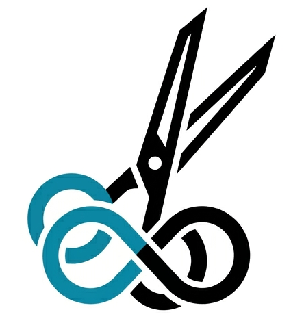
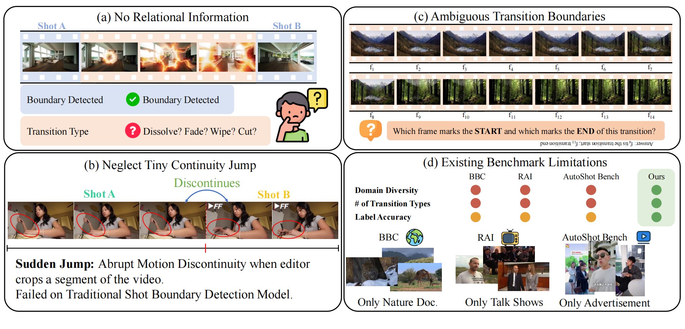
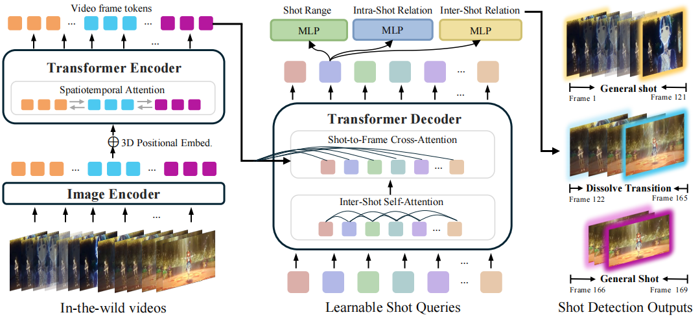

<p align="center">
    
</p>

## OmniShotCut: Holistic Relational Shot Boundary Detection with Shot-Query Transformer

OmniShotCut is a sensitive and more informative SoTA on the Shot Boundary Detection. \
OmniShotCut can detect shot changes of the video in diverse sources (anime, vlog, game, shorts, sports, screen recording, etc.), and recognize Sudden Jump and Transitions (dissolve, fade, wipe, etc.) by proposing a Shot-Query-based Video Transformer.


[](https://arxiv.org/abs/2604.24762)
[](https://uva-computer-vision-lab.github.io/OmniShotCut_website/)
<a href="https://huggingface.co/spaces/uva-cv-lab/OmniShotCut"></a>
<a href="https://huggingface.co/uva-cv-lab/OmniShotCut"></a>


🔥 [Update](#Update) **|** 👀 [**Visualization**](#Visualization)  **|** 🔧 [Installation](#Installation) **|** ⚡ [Inference](#fast_inference)  **|** 💻 [OmniShotCut Benchmark](#evaluation)


## <a name="Update"></a>Update 🔥🔥🔥
- [x] Release ArXiv paper
- [x] Release the inference weights
- [x] Release Gradio demo (with online)
- [ ] Release the benchmark
- [ ] Release the training code and curation
      
:star: **If you like OmniShotCut, please help ⭐⭐star⭐⭐ this repo. Thanks!** :hugs:


<p align="center">
    
</p>

<p align="center">
    
</p>


## <a name="Installation"></a> Installation 🔧
```shell
conda create -n OmniShotCut python=3.10
conda activate OmniShotCut
pip install torch==2.5.1 torchvision==0.20.1 torchaudio==2.5.1 --index-url https://download.pytorch.org/whl/cu124
pip install -r requirements.txt
conda install ffmpeg                #   including conda deactivate case (for debug)
```


First, let us download the checkpoint
```shell
mkdir checkpoints
cd checkpoints
wget https://huggingface.co/uva-cv-lab/OmniShotCut/resolve/main/OmniShotCut_ckpt.pth
```


## <a name="fast_inference"></a> Gradio Demo ⚡⚡⚡
Local Gradio can be created by simply running the following:
```shell
python app.py 
```
Click "Running on **public** URL".


## <a name="inference"></a> Inference ⚡
We provide some modes for the inference. 'default' mode will shot the intra and inter label we define.
However, we believe that most users might want the most direct results, which is valid shots without any transitions and sudden jump. To this end, please use '--mode clean_shot'.

Execute the inference by:
```shell
python test_code/inference.py  --checkpoint_path XXX  --input_video_path XXX  --mode clean_shot
```
We will visualize the results by creating a folder named 'demo_video_results', where vertical bar with the same color refer to the same shot.


## 📚 Citation
```bibtex
@article{wang2026omnishotcut,
  title={OmniShotCut: Holistic Relational Shot Boundary Detection with Shot-Query Transformer},
  author={Wang, Boyang and Xu, Guangyi and Tang, Zhipeng and Zhang, Jiahui and Cheng, Zezhou},
  journal={arXiv preprint arXiv:2604.24762},
  year={2026}
}
```


